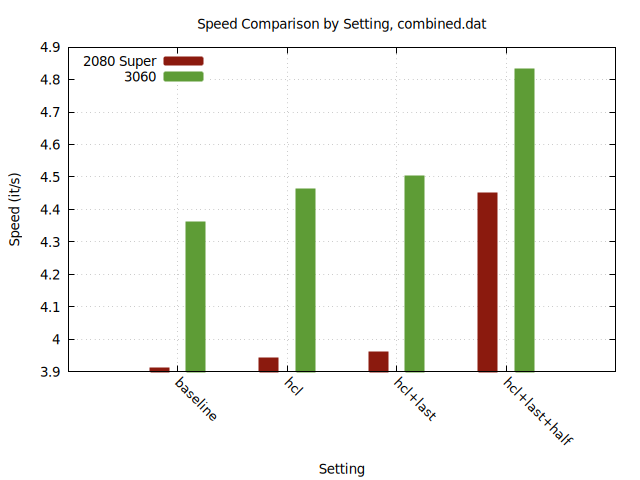
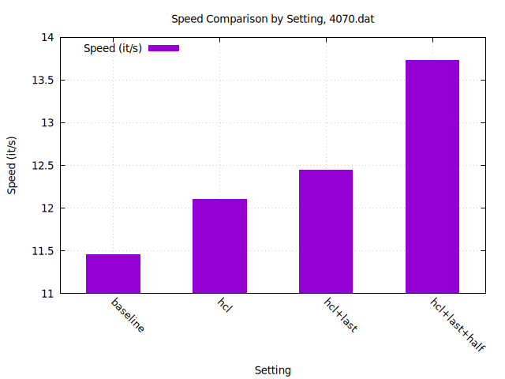

## Graphed Comparison
Manually gathered by:
- Generating 3 "warmup" images and tossing the results
- Generating 20 more images and averaging the reported it/s together
*All were generated with 512x512, 20 steps DPM++ 2M





half indicates `--precision half` was used
\
last indicates `--opt-channelslast` was used
\
**baseline** indicates only settings shown in the last section of this readme were used

### Raw
RTX 4070:
```
baseline - 11.46 it/s
ch. last - 11.8 it/s (not included in graph)
hcl PR - 12.1 it/s
hcl PR, ch. last - 12.44 it/s
hcl PR, ch. last + half - 13.73 it/s
```

RTX 2080 Super:
```
baseline - 3.91 it/s
hcl PR, - 3.94 it/s
hcl PR, ch. last - 3.96 it/s
hcl PR, ch. last + half - 4.45 it/s
```

RTX 3060 12GB:
```
baseline - 4.36 it/s
hcl PR - 4.46 it/s
hcl PR, ch. last - 4.5 it/s
hcl PR, ch. last + half - 4.83 it/s
```


## Extra
all 512x512, 20 steps Euler a, automated benchmarking

Baseline:
1. '4070'(localhost:7860) - 33.89 ipm
2. '3060'(192.168.1.27:7860) - 11.99 ipm
3. '2080 super'(192.168.1.76:7860) - 9.73 ipm\
**Total: ~55.62 ipm**

With all optimizations applied:
1. '4070'(0.0.0.0:7860) - 38.79 ipm
2. '3060'(192.168.1.27:7860) - 13.32 ipm
3. '2080'(192.168.1.76:7860) - 10.59 ipm
\
**Total: ~62.70 ipm**


## Arguments used for each baseline
(COMMANDLINE_ARGS)

4070
```
--enable-insecure-extension-access --opt-sdp-attention --disable-console-progressbar --listen --api`
```

2080 Super
```
--listen --api --opt-sub-quad-attention --medvram-sdxl --api-log --enable-insecure-extension-access --nowebui --port 7860 --api-server-stop`
```

3060
```
--listen --api --opt-sdp-attention --api-log --enable-insecure-extension-access --nowebui --port 7860 --api-server-stop
```
